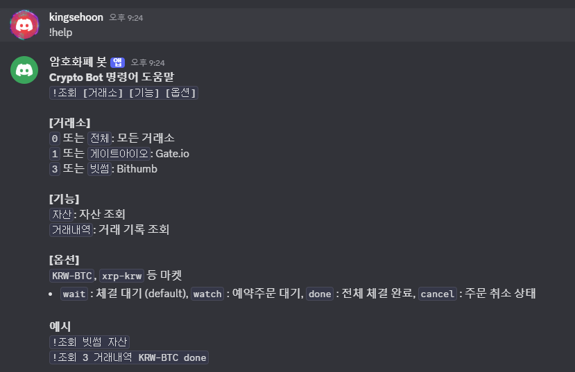
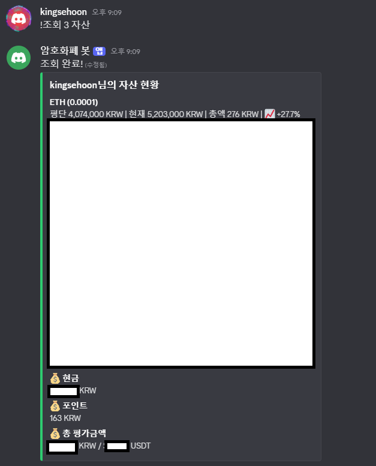
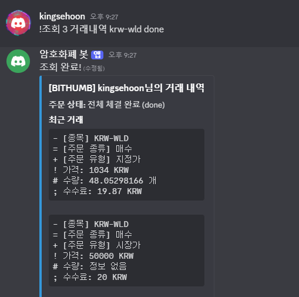

# crypto-discord
디스코드 챗봇 이용한 암호화폐 내역 보기
[해당 프로젝트의 업그레이드 버전](https://github.com/sedoll/bithumb-kakao-api)

## 진행 내역
* 디스코드 챗봇 api 연동 완료 (25-11-11)
* 빗썸 api 연동 완료(25-11-13)

## 추가 일정
* [gateio api](https://github.com/gateio/gateapi-java) 연동
* [bitget api](https://github.com/BitgetLimited/v3-bitget-api-sdk) 연동 - mvn에 없어서 gradle에서 자동으로 못가져와서 sdk를 직접 프로젝트에 넣는 방식으로 진행해야 될 것 같음
* [원달러환율 api](https://www.data.go.kr/data/3068846/openapi.do) 연동 - 매일 원달러 환율 계산해서 원화, USD 가격으로 보여주기 or 빗썸에서 테더(USDT)로 연동하여 보여주기 둘중에 하나의 방식으로 채택 예정
* 운영에서 실제로 할때 리눅스 도커에 반영 예정 (미니 PC)
<br><br><br>

# 라이브러리

## pip
```cmd
pip install discord.py
pip install python-dotenv
pip install requests
```

## gradle
```gradle
repositories {
    mavenCentral()
    maven { url 'https://jitpack.io' }
}

dependencies {
    // Spring Boot Web
    implementation 'org.springframework.boot:spring-boot-starter-web'

    // Gate.io SDK (GitHub → JitPack), JitPack 으로 안하면 인식 안됨
    implementation 'com.github.gateio:gateapi-java:7.1.8'

    // Bithumb/봇 서명 유틸리티
    implementation 'commons-codec:commons-codec'

    // Rate Limiting
    implementation 'com.giffing.bucket4j.spring.boot.starter:bucket4j-spring-boot-starter:0.10.0'

    // JWT 생성용 (com.auth0:java-jwt)
    implementation 'com.auth0:java-jwt:4.5.0'

    // HTTP 요청용 (Apache HttpClient)
    implementation 'org.apache.httpcomponents:httpclient:4.5.14'

    // Test
    testImplementation 'org.springframework.boot:spring-boot-starter-test'
}
```
<br><br><br>

# 디스코드 봇 설정
## 1단계: 🤖 디스코드 개발자 포털에서 봇 생성하기

먼저 봇의 ‘영혼’을 만들어야 합니다.

1. **디스코드 개발자 포털**에 접속 후 로그인합니다.  
2. 오른쪽 상단의 **New Application** 클릭  
3. 봇 이름 입력 (예: `내 암호화폐 봇`) → **Create**  
4. 생성된 애플리케이션에서 왼쪽 메뉴 **Bot** 탭 클릭  
5. **Reset Token** 또는 **Add Bot → Reset Token** 선택  
6. 나타나는 **Click to Reveal Token**을 눌러 토큰을 확인합니다.

> ⚠️ **중요 경고!**  
> 이 토큰은 봇의 *비밀번호*입니다. 절대 노출 금지입니다.  
> → `.env` 또는 `secrets/` 내부 파일로만 보관하세요.

---

### ✅ [필수] Privileged Gateway Intents 설정

이걸 켜지 않으면 봇이 메시지를 못 읽습니다.

1. **Bot** 탭 하단으로 스크롤  
2. **Privileged Gateway Intents** 항목에서 아래 항목을 켜기  
   - **MESSAGE CONTENT INTENT** (메시지 내용 읽기)

---

## 2단계: 🔑 프로젝트에 봇 토큰 설정하기

복사한 토큰을 로컬 & 도커 환경에 적용합니다.

---

### A. 🔧 로컬 개발 환경 (.env.local)

위치: **프로젝트 최상위 폴더** `/my-discord-bot/.env.local`

```env
DISCORD_BOT_TOKEN=YOUR_DISCORD_BOT_TOKEN_HERE
BOT_ACCESS_KEY=my-super-secret-key-12345!@#$     # 이건 내가 임의로 설정한 액세스키
# ... (추가 변수들)
```

---

### B. 🐳 Docker/Production 환경 (secrets/ 폴더)

1. 프로젝트 내 `secrets/` 폴더 이동  
2. **DISCORD_BOT_TOKEN** 이름의 파일 생성 (없으면 생성)  
3. 내용은 오직 **토큰 문자열만 1줄**로 저장

파일 예시:

```
NzI3MjU4...이하생략...R9DQ
```

---

## 3단계: 💌 봇을 내 디스코드 서버에 초대하기

1. 다시 **디스코드 개발자 포털**로 이동  
2. 좌측 메뉴 **OAuth2 → URL Generator** 클릭  
3. **SCOPES** 항목에서 아래 체크  
   - `bot` ✔  
4. 아래 **BOT PERMISSIONS**에서 권한 선택  
   - **Send Messages**  
   - **Read Message History**  
   - **Embed Links**  
   - (필요시) Read Messages / View Channels  
5. 아래 생성된 **GENERATED URL**을 Copy  
6. 브라우저에 붙여넣고 접속  
7. 초대할 서버 선택 → **승인(Authorize)**

이제 디스코드 서버에  
**“내 암호화폐 봇이 서버에 참가했습니다!”**  
라는 메시지가 뜨면 성공입니다 🎉
<br><br><br>

# 결과 이미지

## 빗썸

### 명령어 조회


### 자산조회
```
!조회 빗썸 자산
!조회 3 자산
```


### 거래내역
```
!조회 빗썸 krw-btc
!조회 빗썸 KRW-ETH wait
!조회 3 krw-doge done
```
